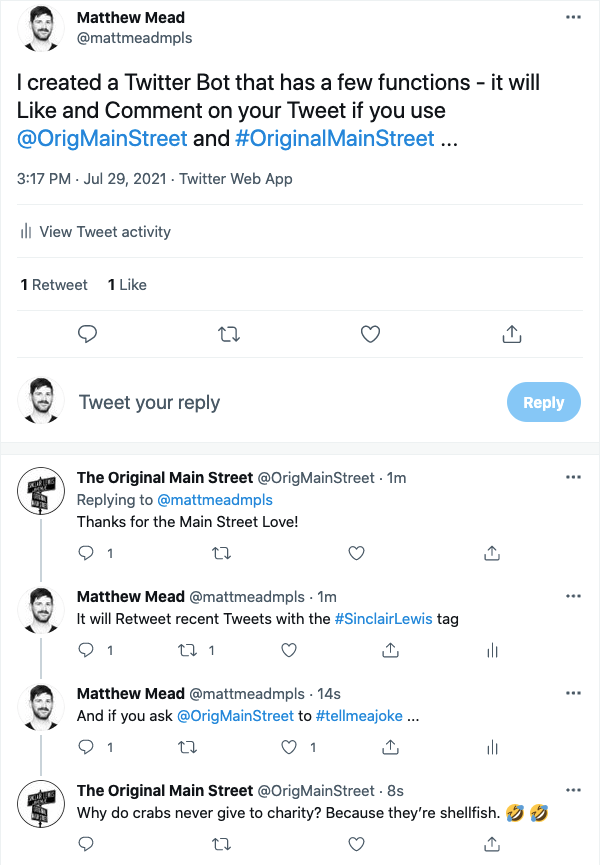
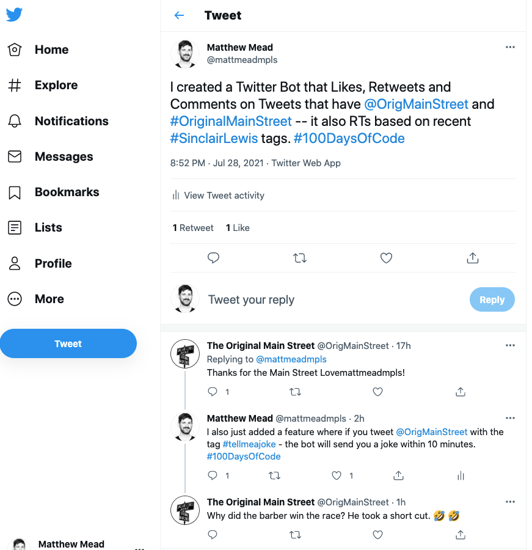
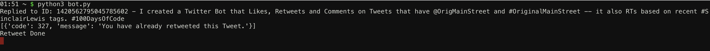
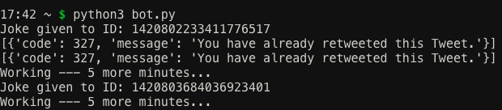
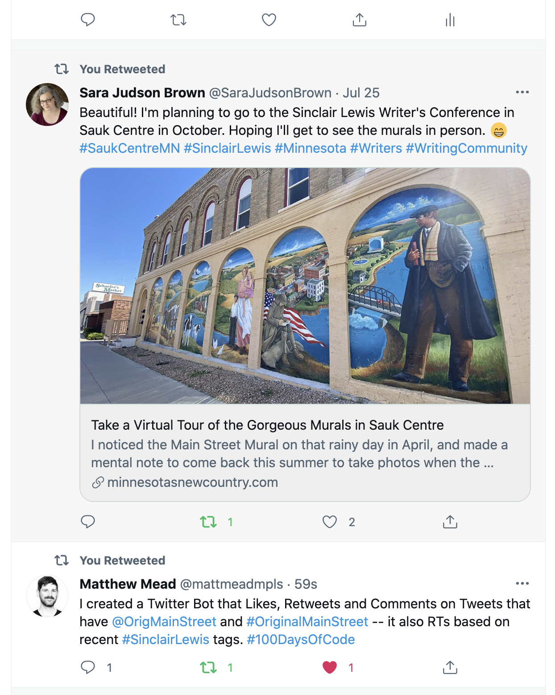

# The Original Main Street Twitter Bot

Adapted from the Udemy course on Creating a [Twitter Bot](https://www.udemy.com/share/101I4E2@FG5gfWJKcFQMcE5GBXpzRD5HY1diSnA=/), this bot has a few functionalities that include:

1. Likes and Responds to users who Tweet using both **@OrigMainStreet** and the tag **#OriginalMainStreet**
2. It Retweets recent Tweets that use the **#SinclairLewis** tag
3. It will use the [_Icanhazdadjoke.com API_](https://icanhazdadjoke.com/api) to send a random joke to those who Tweet **@OrigMainStreet** with the tag **#tellmeajoke**

The bot runs on a console on PythonAnywhere - due to using the free account, the bot has to be re-run every 24 hours.

# Screen Shots

_This is the Bot's full functionality - the user Tweeted **@OrigMainStreet** with both the **#OriginalMainStreet** and **#SinclairLewis** tags which caused the bot to Like and Comment (because of the @OrigMainStreet and #OriginalMainStreet) and then Retweet (because of the #SinclairLewis). Then, the user Tweeted using **OrigMainStreet** with the **#tellmeajoke** tag, triggering the bot to use the joke API to reply to the user with a random joke_

_Here's the code running in the PythonAnywhere console_

_The user who just Tweeted using **#SinclairLewis** was Retweeted and the user who used **@OrigMainStreet** and the **#OriginalMainStreet** and **#SinclairLewis** tag was Liked, commented back to, and Retweeted._

